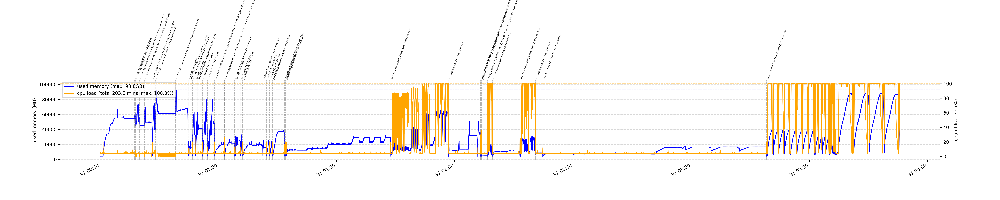
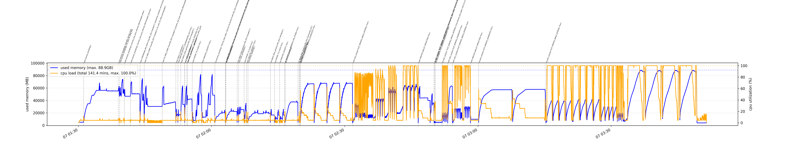
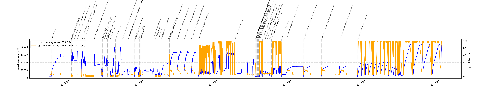
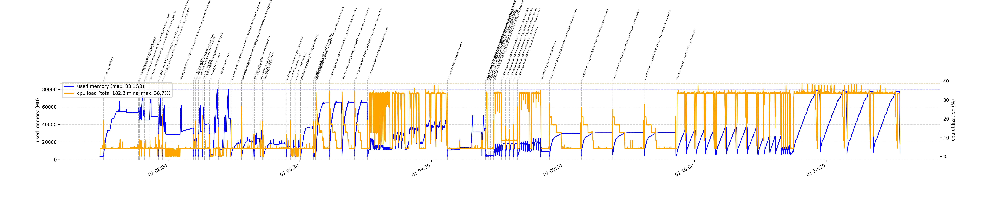
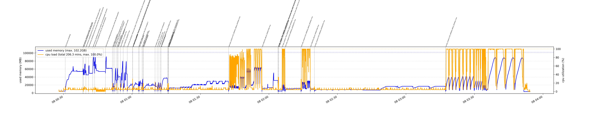

# Performance

The processing and visualization of all coinjoins done by the [```coinjoin-analysis```](https://github.com/crocs-muni/coinjoin-analysis/) tooling are time-consuming and memory-intensive operations and need to be considered before usage. The design decision is to target a computational platform that is reasonably powerful, yet still easily accessible to any serious user.  

As of December 2025, the current nightly complete processing is performed on a machine with 128 GB RAM and Intel 13th Gen Intel(R) Core(TM) i7-13700KF with 24 cores and finishes in about 2 hours 40 mins with 88 GB peak RAM usage. The peak memory usage is required only for short time intervals, with a large majority of computation requiring less than 60 GB; therefore, a machine with 64 GB RAM and 32 GB swap file shall also be applicable (although not optimal for the SSD wear). The CPU is not a significant bottleneck though; when only 8 cores are used, the processing time is extended only mildly to about 3 hours and with 80 GB RAM required.



The custom performance profiling setup is used, combining [```log_perf.sh```](https://github.com/crocs-muni/coinjoin-analysis/blob/main/scripts/log_perf.sh) measurements with custom data produced by measured scripts. [```perf_processing.py```](https://github.com/crocs-muni/coinjoin-analysis/blob/main/src/helpers/perf_processing.py) is used for visualization.

## Optimization techniques used

The optimization utilizes the following primary techniques:
 * Load all data into RAM memory and process there.
 * Decrease peak memory usage by splitting operations into separate Python calls to enforce garbage collection (```del ``` and ```gc.collect()``` do not work).
 * Decrease peak memory usage by compacting/pruning data structures loaded into memory (```PERF_USE_COMPACT_CJTX_STRUCTURE=True```).
 * Decrease processing time by parallelization of tasks over multiple CPU cores (```ProcessPoolExecutor``` used).
 * Decrease processing time by the use of fast access structures (typically HashMap).

**Note:** The memory requirements slowly grow over time as more coinjoins are processed in total. 

### Time-memory tradeoff
The parallelization over multiple cores shortens the processing time, but also (typically) increases combined memory usage due to data utilized by every core. Empirically, the RAM is primary bottleneck for ```coinjoin-analysis``` processing.   

The number of real available cores is obtained via ```multiprocessing.cpu_count()```, but limited to the upper bound of ```SAFE_CPU_CORES=24``` to limit peak RAM usage (below 90 GB in 12/2025). If both more memory and cores are available, increase the ```SAFE_CPU_CORES``` value in ```cj_consts.py```. If less cores are available, the processing is automatically scaled down to it.  

Example: Processing on 31.12.2025 took 2 hours 39 mins and 88.0 GB peak RAM usage with 24 cores used, while 3 hours and 2 mins and 80.1 GB peak RAM usage if only 8 cores are used (```SAFE_CPU_CORES=8```).

## Performance snapshot 2026-01-06
 * Total processing time: 2 hours 21 mins, peak RAM usage: 88.9 GB
 * Minor improvement in parallelization of ```PLOT_REMIXES_AGGREGATE=True```
 


## Performance snapshot 2025-12-31
 * Total processing time: 2 hours 39 mins, peak RAM usage: 88.0 GB
 * Processing of the complete ```'wasabi2'``` folder was separated from the rest of the WW2 pools into a separate python invocation to decrease peak memory usage (```STREAMLINE_MIX_DATA```, ```FIX_WW2_FDNP```) from 102.2GB to 88.0 GB.
 * Parallelization of aggregate plotting of a whole mix interval (```PLOT_REMIXES_AGGREGATE=True```, e.g., ```wasabi2_cummul_values_norm.png```) for all mix designs (ww1, ww2, sw, aw, jm). Decreased plotting time roughly 62 mins -> 30 mins (sw) and 27 -> 15 mins (ww2). Parallelization is performed over all pools for the given configuration to prevent memory overflow.


 * If only 8 cores are allowed (```SAFE_CPU_CORES=8```), the total processing time is increased (only) to 3 hours 2 minutes, but with decreased peak memory to 80.1 GB. Practically only 22 minutes expected slowdown for "normal" machine with smaller number of cores (the maximum load of 38.7% is result of limiting available cores from 24 to 8).

 

## Performance snapshot 2025-12-08
* Total processing time: 3h 26min, peak RAM usage: 102.2 GB
* Initial performance-profiled version, most of the optimization techniques already applied




